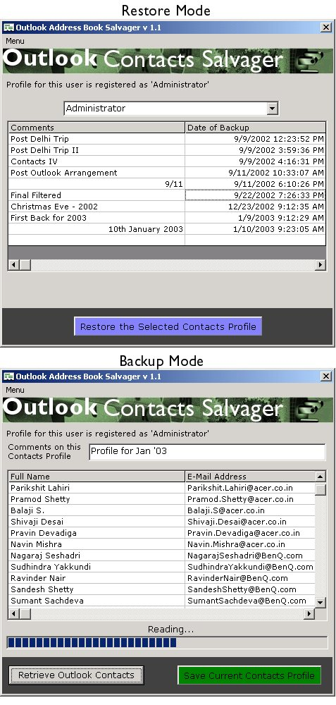



## \[A1 Outlook Professional \- Address Book Backup and Restore

### Description

Backup and Restore your Outlook Address Books contacts. You can save your contacts as different profiles which means you can maintain different contact books and restore it whenever and wherever you want! Saves you considerable of time and resources since your address book is now intact and is stored in a Central repository. Ideal for a network environment with a central Database server(SQL Server, preferably).
 
### More Info
 
You need to have an instance of SQL Server running. The database script is provided with this article which you can separately deploy. Change the snippet in the "FORM LOAD" to update the relevant username and password.

             |
---                |---
**Submitted On**   |2003-01-09 17:32:14
**By**             |[Arun Nair](https://github.com/Planet-Source-Code/PSCIndex/blob/master/ByAuthor/arun-nair.md)
**Level**          |Intermediate
**User Rating**    |4.8 (38 globes from 8 users)
**Compatibility**  |VB 6\.0
**Category**       |[Databases/ Data Access/ DAO/ ADO](https://github.com/Planet-Source-Code/PSCIndex/blob/master/ByCategory/databases-data-access-dao-ado__1-6.md)
**World**          |[Visual Basic](https://github.com/Planet-Source-Code/PSCIndex/blob/master/ByWorld/visual-basic.md)
**Archive File**   |[Outlook\_Pr152631192003\.zip](https://github.com/Planet-Source-Code/arun-nair-a1-outlook-professional-address-book-backup-and-restore__1-42292/archive/master.zip)

